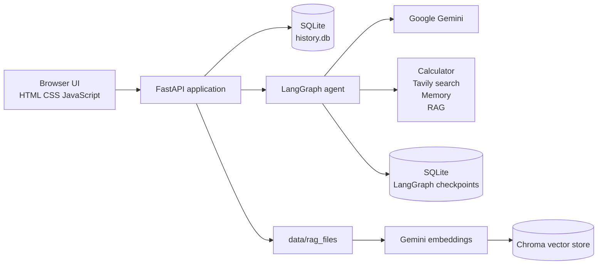

# LangGraphChat

LangGraphChat is an open-source, locally hosted AI chat application built with FastAPI and LangGraph. It provides persistent conversation threads, long-term memory, web search, calculations, and retrieval-augmented generation (RAG) over documents uploaded to a conversation.

The application is designed as a small, self-contained project that can be run on a developer machine. Conversation data, LangGraph checkpoints, uploaded files, and Chroma embeddings are stored locally by default.

## Features

- Chat with Google Gemini models through LangChain and LangGraph.
- Organize conversations into persistent threads.
- Keep thread-specific long-term memories that the assistant can save and recall.
- Search the web with Tavily and expose tool usage in the conversation history.
- Calculate mathematical expressions with the calculator tool.
- Upload and search documents with RAG.
- Display uploaded files alongside messages in the conversation timeline.
- Support PDF, DOCX, TXT, Markdown, Python, CSV, and JSON files.
- Delete a thread together with its messages, memories, uploaded files, and associated Chroma vectors.
- Use a responsive browser interface served directly by FastAPI.

## How It Works



When a user sends a message, the API stores it in the current thread and invokes a LangGraph workflow. The workflow calls Gemini, conditionally executes tools, and returns the assistant response. Thread state is checkpointed in SQLite. Uploaded documents are extracted, split into overlapping chunks, embedded, and stored in Chroma with the thread ID as metadata so searches remain isolated between conversations.

## Technology Stack

### Backend

- **Python 3.14+**: Application runtime.
- **FastAPI**: HTTP API, request validation, file uploads, and server-rendered entry point.
- **Uvicorn**: Local ASGI server.
- **Jinja2**: HTML template rendering.
- **SQLAlchemy**: ORM for threads, messages, tool invocations, memories, and uploaded files.
- **SQLite**: Local relational persistence for application data and LangGraph checkpoints.
- **python-dotenv**: Loads local environment variables from `.env`.

### AI and orchestration

- **LangGraph**: Stateful agent workflow and checkpointing.
- **LangChain**: Messages, tools, document loading, text splitting, and model integration.
- **Google Gemini**: Chat completion and document embeddings through `langchain-google-genai`.
- **Tavily**: Advanced web search tool.

### Retrieval and file processing

- **ChromaDB**: Persistent vector storage for document chunks.
- **RecursiveCharacterTextSplitter**: Splits uploaded content into 1,000-character chunks with 200-character overlap.
- **pypdf**: Extracts text from PDF files.
- **docx2txt**: Extracts text from DOCX files.

### Frontend

- Server-rendered HTML in `templates/index.html`.
- Plain CSS in `static/styles.css`.
- Browser-side JavaScript modules in `static/utils.js` and the main template.
- No frontend build step is required.

## Requirements

- Python 3.14 or newer.
- A Google AI API key with access to the configured Gemini model.
- A Tavily API key if web search is used.
- Conda is optional; any Python virtual environment is supported.

## Installation

### 1. Clone the repository

```bash
git clone https://github.com/skszymon20/LangGraphChat.git
cd LangGraphChat
```

### 2. Create and activate a virtual environment

Using Conda:

```bash
conda create -n langgraphchat python=3.14 -y
conda activate langgraphchat
```

Using Python's built-in virtual environment:

```bash
python -m venv .venv
source .venv/bin/activate
```

On Windows PowerShell, activate with:

```powershell
.venv\Scripts\Activate.ps1
```

### 3. Install dependencies

```bash
python -m pip install -r requirements.txt
```

### 4. Configure environment variables

Create a `.env` file in the project root:

```dotenv
GOOGLE_API_KEY=your_google_api_key
TAVILY_API_KEY=your_tavily_api_key

# Optional. Defaults to gemini-3.5-flash-lite.
GOOGLE_MODEL=gemini-3.5-flash-lite

# Moreover you can configure LANGSMITH tracing of the application
LANGSMITH_TRACING=true
LANGSMITH_ENDPOINT=your_langsmith_endpoint_url
LANGSMITH_API_KEY=your_langsmith_api_key
LANGSMITH_PROJECT=your_langsmith_project_name
```

Supported model values are:

- `gemini-3.5-flash-lite`
- `gemini-3.5-flash`
- `gemini-2.5-flash-lite`
- `gemini-2.5-flash`

Never commit real API keys. Keep `.env` local and rotate any credential that has been exposed.

## Running the Application

Start the development server with:

```bash
python app.py
```

Open [http://127.0.0.1:8000](http://127.0.0.1:8000) in a browser. The application runs Uvicorn with auto-reload enabled and binds to localhost on port `8000`.

You can also start Uvicorn directly:

```bash
uvicorn app:app --host 127.0.0.1 --port 8000 --reload
```

## Supported Documents

The upload endpoint accepts the following extensions:

`.pdf`, `.docx`, `.txt`, `.md`, `.py`, `.csv`, `.json`

Uploaded files are copied to `data/rag_files/`. Their text is extracted and indexed in the Chroma `documents` collection. Retrieval is filtered by thread ID, so an assistant only searches documents uploaded to the active conversation.

## API Overview

FastAPI's interactive API documentation is available at `/docs` while the server is running.

| Method | Endpoint | Purpose |
| --- | --- | --- |
| `GET` | `/` | Serve the chat interface. |
| `GET` | `/api/threads` | List conversation threads. |
| `POST` | `/api/threads` | Create a thread. |
| `DELETE` | `/api/threads/{thread_id}` | Delete a thread and related local data. |
| `GET` | `/api/threads/generating` | List threads currently generating responses. |
| `POST` | `/api/messages` | Send a message and receive the user and assistant messages. |
| `GET` | `/api/messages/{thread_id}` | List messages for a thread. |
| `GET` | `/api/conversation/{thread_id}` | Return messages and uploaded files in timeline order. |
| `POST` | `/api/files/{thread_id}` | Upload and index a document for a thread. |
| `GET` | `/api/files/{thread_id}` | List files uploaded to a thread. |
| `GET` | `/api/files/uploading` | Report active uploads. |

## Project Structure

```text
.
├── agent.py                         # LangGraph workflow and Gemini model configuration
├── app.py                           # FastAPI application and HTTP endpoints
├── config.py                        # Message and upload limits
├── database.py                      # SQLAlchemy engine and session dependency
├── models.py                        # Database models
├── schemas.py                       # Pydantic request and response schemas
├── rag.py                           # File extraction, chunking, embeddings, and retrieval
├── tools.py                         # Calculator, web search, memory, and RAG tools
├── requirements.txt                 # Pinned Python dependencies
├── templates/index.html              # Chat page and browser interaction logic
├── static/styles.css                 # UI styles
├── static/utils.js                   # Browser API helpers
├── data/history.db                  # Application database, created at runtime
├── data/langgraph_ckpts.sqlite       # Agent checkpoints, created at runtime
├── data/rag_files/                   # Uploaded source files, created at runtime
└── data/chroma.sqlite3/              # Persistent Chroma data, created at runtime
```

Runtime data directories are intentionally local and should be backed up or excluded from source control according to your deployment needs.

## Testing and Development Notes

The repository currently includes exploratory/manual scripts rather than a configured automated test suite:

```bash
python test.py
```

`test.py` exercises the LangGraph agent directly and requires the configured model credentials. For production use, add isolated tests around the API, database lifecycle, tool behavior, and RAG filtering before exposing the service beyond localhost.

## Configuration Notes

- User messages are limited to 8,192 characters.
- Only one response may be generated for a thread at a time; concurrent attempts receive HTTP `409`.
- The calculator evaluates expressions using a restricted global namespace. It is intended for trusted local use and should be reviewed or replaced before accepting untrusted expressions in a public deployment.
- The default server configuration is for local development. Add authentication, HTTPS, rate limiting, access controls, and a production process manager before deploying it publicly.

## License

See [LICENSE](LICENSE) for the project's license.
